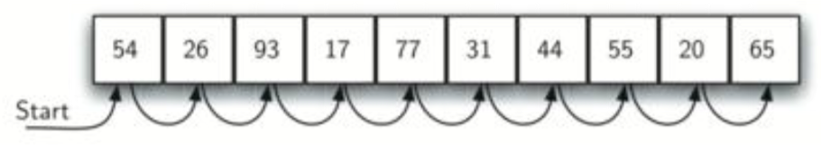
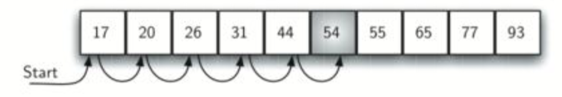
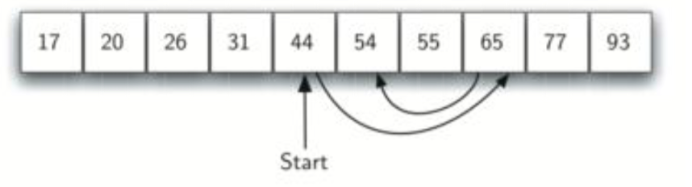
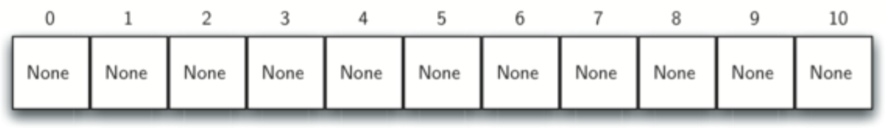
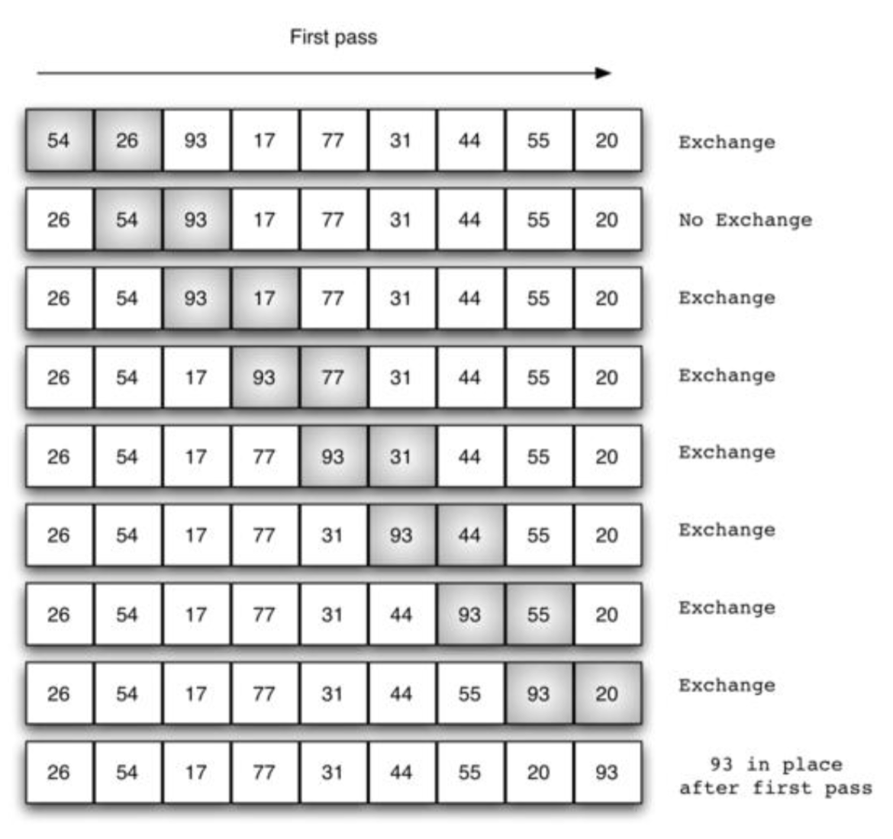

# 第五章－搜索和排序

## 5.1 Objectives
- To be able to explain and implement sequential search and binary search.
- To be able to explain and implement selection sort, bubble sort, merge sort, quick sort, insertion sort, and shell sort.
- To understand the idea of hashing as a search technique. To introduce the map abstract data type.
- To implement the map abstract data type using hashing.

- 能够理解和实现顺序搜索和二分搜索
- 能够理解和实现选择排序、冒泡排序、合并排序、快速排序、插入排序和shell排序。
- 理解把hash做为一种搜索技术的理念。介绍映射抽象数据类型
- 使用hash实现映射抽象数据类型

## 5.2 Searching 搜索
We will now turn our attention to some of the most common problems that arise in computing, those of searching and sorting. In this section we will study searching. We will return to sorting later in the chapter. Searching is the algorithmic process of finding a particular item in a collection of items. A search typically answers either True or False as to whether the item is present. On occasion it may be modified to return where the item is found. For our purposes here, we will simply concern ourselves with the question of membership.  

In Python, there is a very easy way to ask whether an item is in a list of items. We use the in operator.  

```shell
>>> 15 in [3,5,2,4,1]
False
>>> 3 in [3,5,2,4,1]
True
>>>
```

Even though this is easy to write, an underlying process must be carried out to answer the question. It turns out that there are many different ways to search for the item. What we are interested in here is how these algorithms work and how they compare to one another.  


Figure5.1: TheSequentialSearchofaListofIntegers  

--------------------- Start copy from Fundamentals of Python®: Data Structures---------------------

### Search for the Minimum 查找最小值
Python’s min function returns the minimum or smallest item in a list. To study the com- plexity of this algorithm, you’ll develop an alternative version that returns the index of the minimum item. The algorithm assumes that the list is not empty and that the items are in arbitrary order. The algorithm begins by treating the first position as that of the minimum item. It then searches to the right for an item that is smaller and, if it is found, resets the position of the minimum item to the current position. When the algo- rithm reaches the end of the list, it returns the position of the minimum item. Here is the code for the algorithm, in function indexOfMin:  

Python的min函数返回一个列表中的最小的项。为了研究该算法的复杂度，要编写一个返回最小项的索引的替代版本。该算法假设列表非空，而且项的顺序都是任意的。算法开始把第一个位置当作最小的项。然后向后搜索一个更小的项，如果找的到话，重设最小项的位置。当算法抵达列表的末尾，就返回最小项的位置。在函数indexOfMin中给出了该算法的代码：  

```python
def indexOfMin(lyst):
    """Returns the index of the minimum item. 返回最小项的索引""" 
    minIndex = 0
    currentIndex = 1

    while currentIndex < len(lyst):
        if lyst[currentIndex] < lyst[minIndex]: 
            minIndex = currentIndex
        currentIndex += 1 

    return minIndex


# 译者实现for版本
def mymin(l):
    m = 0
    c = 1
    for i in range(len(l) - 1):
        if l[c] < l[m]:
            m = c
        c += 1
    return l[m]
```


As you can see, there are three instructions outside the loop that execute the same num- ber of times regardless of the size of the list. Thus, you can discount them. Within the loop are three more instructions. Of these, the comparison in the if statement and the increment of currentIndex execute on each pass through the loop. There are no nested or hidden loops in these instructions. This algorithm must visit every item in the list to guarantee that it has located the position of the minimum item. Thus, the algorithm must make n – 1 comparisons for a list of size n. Therefore, the algorithm’s complexity is O(n).  

如你所见，在执行相同次数的无视列表大小的循环之外有三条命令。因此，去掉它们。在循环里面超过三条命令。其中，相比较if语句和currentIndex增加的执行通过每次传递到循环。在这些指令中没有嵌套或者隐藏的循环。该算法必须访问列表中的每个项，以便保证获得最小项的索引位置。因此，相较于列表大小n，算法必须执行n－1 。 这样，该算法的复杂度为O(n)。  

------------------------------- End copy from Fundamentals of Python®: Data Structures ---------------------

## 5.2.1 The Sequential Search 顺序搜索
When data items are stored in a collection such as a list, we say that they have a linear or sequential relationship. Each data item is stored in a position relative to the others. In Python lists, these relative positions are the index values of the individual items. Since these index values are ordered, it is possible for us to visit them in sequence. This process gives rise to our first searching technique, the sequential search.  

当数据项存储在一个集合中，比如列表，我们就可以说它们具有线性或者

Figure 5.1 shows how this search works. Starting at the first item in the list, we simply move from item to item, following the underlying sequential ordering until we either find what we are looking for or run out of items. If we run out of items, we have discovered that the item we were searching for was not present.  

图5.1展示了该搜索是如何进行工作的。从列表中的第一项开始，我们

The Python implementation for this algorithm is shown below. The function needs the list and the item we are looking for and returns a boolean value as to whether it is present. The boolean variable found is initialized to False and is assigned the value True if we discover the item in the list.  

该算法的Python实现如下。函数需要列表和我们要查找的项，并根据项是否存在返回布尔值。布尔值found初始化为False，

```python
def sequential_search(a_list, item):
    pos = 0
    found = False
    while pos < len(a_list) and not found:
        if a_list[pos] == item:
            found = True
        else:
            pos = pos+1
    return found

test_list = [1, 2, 32, 8, 17, 19, 42, 13, 0]

print(sequential_search(test_list, 3))
print(sequential_search(test_list, 13))
```

## Analysis of Sequential Search 分析按序搜索
To analyze searching algorithms, we need to decide on a basic unit of computation. Recall that this is typically the common step that must be repeated in order to solve the problem. For searching, it makes sense to count the number of comparisons performed. Each comparison may or may not discover the item we are looking for. In addition, we make another assumption here. The list of items is not ordered in any way. The items have been placed randomly into the list. In other words, the probability that the item we are looking for is in any particular position is exactly the same for each position of the list.  

要分析搜索算法，我们需要确定一个基本的计算单位。回想一下一般是必需重复公有步骤来解决这个问题。

|Case|Best Case|Worst Case| Average Case|
|:--:|:------:|:---------:|:-----------:|
|item is present|1|n|$\frac 2 n$|
|item is not present|n|n|n|

Table 5.1: Comparisons Used in a Sequential Search of an Unordered List  



Figure 5.2: Sequential Search of an Ordered List of Integers  

If the item is not in the list, the only way to know it is to compare it against every item present. If there are n items, then the sequential search requires n comparisons to discover that the item is not there. In the case where the item is in the list, the analysis is not so straightforward. There are actually three different scenarios that can occur. In the best case we will find the item in the first place we look, at the beginning of the list. We will need only one comparison. In the worst case, we will not discover the item until the very last comparison, the nth comparison.  

如果项不在列表中，确认项的唯一方式就是和每一个出现的项进行比较。如果项存在，那么为了发现项不在那里，顺序搜索需要请求n次比较。在项出现在列表中的情况下，分析就不是那么简洁明了了。实际上可能出现三种不同的场景。在最好的情况下， 我们在列表的开始的地方的一个地方找到了项。我们只需要一次比较。在最坏情况，我们直到非常靠后的比较，第n次比较才能找到项。  

What about the average case? On average, we will find the item about halfway into the list; that is, we will compare against $\frac 2 n$ items. Recall, however, that as n gets large, the coefficients,
no matter what they are, become insignificant in our approximation, so the complexity of the sequential search, is O(n). Table 5.1 summarizes these results.  

那么平均情况呢？

We assumed earlier that the items in our collection had been randomly placed so that there is no relative order between the items. What would happen to the sequential search if the items were ordered in some way? Would we be able to gain any efficiency in our search technique?  

我们假设之前出现在集合中的项被随机的放置了，所以项之间也不再有关联顺序。在项按照某种办法排序之后再执行搜索会发生什么呢？我们能从这个搜索技术中得到高效手法吗？

Assume that the list of items was constructed so that the items were in ascending order, from low to high. If the item we are looking for is present in the list, the chance of it being in any one of the n positions is still the same as before. We will still have the same number of comparisons to find the item. However, if the item is not present there is a slight advantage. Figure 5.2 shows this process as the algorithm looks for the item 50. Notice that items are still compared in sequence until 54. At this point, however, we know something extra. Not only is 54 not the item we are looking for, but no other elements beyond 54 can work either since the list is sorted. In this case, the algorithm does not have to continue looking through all of the items to report that the item was not found. It can stop immediately.  

假设列表的项已经构造好了，因此项都是升序的，从低到高。如果我们要找的项出现列表中，那么项出现在列表中第n歌位置的机会和之前一样。我们仍旧要比较想通多的次数才能找到项。不过，假如项不在那个地方还是有点儿好处的。图5.2展示了用该算法查找项50。注意项项仍旧是按照顺序来比较的，直到54为止。

```python
def ordered_sequential_search(a_list, item):
    pos = 0
    found = False
    stop = False

    while pos < len(a_list) and not found and not stop:
        if a_list[pos] == item:
            found = True
        else:
            if a_list[pos] > item:
                stop = True
            else:
                pos = pos+1
        return found

test_list = [0, 1, 2, 8, 13, 17, 19, 32, 42,]
print(ordered_sequential_search(test_list, 3))
print(ordered_sequential_search(test_list, 13))
```


|情况 |最佳情况|最差情况|平均情况|
|:---:|:-------:|:-------:|:-----------:|
|项存在|1|n|$\frac n 2$|
|项不存在|1|n|$\frac n 2$|
Table 5.2: Comparisons Used in Sequential Search of an Ordered List  


Table 5.2 summarizes these results. Note that in the best case we might discover that the item is
not in the list by looking at only one item. On average, we will know after looking through only $\frac n 2$ items. However, this technique is still O(n). In summary, a sequential search is improved by 2
ordering the list only in the case where we do not find the item.

### Self Check
Supposeyouaredoingasequentialsearchofthelist[15,18,2,19,18,0,8,14,19,14]. How many comparisons would you need to do in order to find the key 18?  

1. 5 
2. 10 
3. 4 
4. 2

Suppose you are doing a sequential search of the ordered list [3, 5, 6, 8, 11, 12, 14, 15, 17, 18]. How many comparisons would you need to do in order to find the key 13?  

假设正在对一个已排序过的列表[3, 5, 6, 8, 11, 12, 14, 15, 17, 18]执行按序搜索。那么请问，你需要多少次比较才能找到键13？  

1. 10 
2. 5 
3. 7 
4. 6

### 5.2.2 The Binary Search 二分查找
It is possible to take greater advantage of the ordered list if we are clever with our comparisons. In the sequential search, when we compare against the first item, there are at most n - 1 more items to look through if the first item is not what we are looking for. Instead of searching the list in sequence, a **binary search** will start by examining the middle item. If that item is the one we are searching for, we are done. If it is not the correct item, we can use the ordered nature of the list to eliminate half of the remaining items. If the item we are searching for is greater than the middle item, we know that the entire lower half of the list as well as the middle item can be eliminated from further consideration. The item, if it is in the list, must be in the upper half.  



Figure 5.3: Binary Search of an Ordered List of Integers

We can then repeat the process with the upper half. Start at the middle item and compare it against what we are looking for. Again, we either find it or split the list in half, therefore eliminating another large part of our possible search space. Figure 5.3 shows how this algorithm can quickly find the value 54.  

然后我们可以重复上半部分的的处理过程。从中间项开始，然后和我们要查找的项进行比较。再者，我们要么找到了它，要么把列表切掉一本，这样就可以消除另外的我们可能搜索要搜索部分的大值。图5。3展示了该算法是如何快速找到值54的。  

```python
def binary_search(a_list, item):

    first = 0
    last = len(a_list) - 1
    found = False

    while first <= last and not found:
        midpoint = (first + last) // 2
        if a_list[midpoint] == item:
            found = True
        else:
            if item < a_list[midpoint]:
                last = midpoint - 1
            else:
                first = midpoint + 1
    
    return found

test_list = [0, 1, 2, 8, 13, 17, 19, 32, 42,]
print(binary_search(test_list, 3))
print(binary_search(test_list, 13))
```

Before we move on to the analysis, we should note that this algorithm is a great example of a divide and conquer strategy. Divide and conquer means that we divide the problem into smaller pieces, solve the smaller pieces in some way, and then reassemble the whole problem to get the result. When we perform a binary search of a list, we first check the middle item. If the item we are searching for is less than the middle item, we can simply perform a binary search of the left half of the original list. Likewise, if the item is greater, we can perform a binary search of the right half. Either way, this is a recursive call to the binary search function passing a smaller list.  

在我们进行分析之前，我们应该主要到这个算法非常棒的分治策略示例。分治意味着

|比较 |项左边的大概数量|
|:---|:------------:|
|1|$\frac n 2$|
|2|$\frac n 4$|
|3|$\frac n 8$|
|..|...|
|i|$\frac n {2^i}$|
Table 5.3: Tabular Analysis for a Binary Search  

```python
def binary_search(a_list, item):
    if len(a_list) == 0:
       return False
  else:
    midpoint = len(a_list) // 2
  if a_list[midpoint] == item:
    return True
  else:
    if item < a_list[midpoint]:
       return binary_search(a_list[:midpoint], item)
    else:
       return binary_search(a_list[midpoint + 1:], item)
test_list = [0, 1, 2, 8, 13, 17, 19, 32, 42,]
print(binary_search(test_list, 3))
print(binary_search(test_list, 13))
```

### Analysis of Binary Search
To analyze the binary search algorithm, we need to recall that each comparison eliminates about
half of the remaining items from consideration. What is the maximum number of comparisons this algorithm will require to check the entire list? If we start with n items, about $\frac n 2$ items will be left after the first comparison. After the second comparison, there will be about $\frac n 4$ . Then $\frac n 8$, $\frac n 16$ and so on. How many times can we split the list? Table 5.3 helps us to see the answer.  

When we split the list enough times, we end up with a list that has just one item. Either that is the item we are looking for or it is not. Either way, we are done. The number of comparisons necessary to get to this point is i where $\frac n {2^i} = 1$. Solving for i gives us $i = log n$. The maximum number of comparisons is logarithmic with respect to the number of items in the list. Therefore, the binary search is $O(log n)$.  

One additional analysis issue needs to be addressed. In the recursive solution shown above, the recursive call, binary_search(a_list[:midpoint],item).  

uses the slice operator to create the left half of the list that is then passed to the next invocation (similarly for the right half as well). The analysis that we did above assumed that the slice operator takes constant time. However, we know that the slice operator in Python is actually O(k). This means that the binary search using slice will not perform in strict logarithmic time. Luckily this can be remedied by passing the list along with the starting and ending indices.  

Even though a binary search is generally better than a sequential search, it is important to note that for small values of n, the additional cost of sorting is probably not worth it. In fact, we should always consider whether it is cost effective to take on the extra work of sorting to gain searching benefits. If we can sort once and then search many times, the cost of the sort is not so significant. However, for large lists, sorting even once can be so expensive that simply performing a sequential search from the start may be the best choice.  

### Self Check
Suppose you have the following sorted list [3, 5, 6, 8, 11, 12, 14, 15, 17, 18] and are using the recursive binary search algorithm. Which group of numbers correctly shows the sequence of comparisons used to find the key 8.  

1. 11,5,6,8 
2. 12,6,11,8 
3. 3,5,6,8 
4. 18,12,6,8

Suppose you have the following sorted list [3, 5, 6, 8, 11, 12, 14, 15, 17, 18] and are using the recursive binary search algorithm. Which group of numbers correctly shows the sequence of comparisons used to search for the key 16?  

1. 11,14,17 
2. 18,17,15 
3. 14,17,15 
4. 12,17,15

### 5.2.3 Hashing
In previous sections we were able to make improvements in our search algorithms by taking advantage of information about where items are stored in the collection with respect to one another. For example, by knowing that a list was ordered, we could search in logarithmic time using a binary search. In this section we will attempt to go one step further by building a data structure that can be searched in O(1) time. This concept is referred to as hashing.  

In order to do this, we will need to know even more about where the items might be when we go to look for them in the collection. If every item is where it should be, then the search can use a single comparison to discover the presence of an item. We will see, however, that this is typically not the case.  

A hash table is a collection of items which are stored in such a way as to make it easy to find them later. Each position of the hash table, often called a slot, can hold an item and is named by an integer value starting at 0. For example, we will have a slot named 0, a slot named 1, a slot named 2, and so on. Initially, the hash table contains no items so every slot is empty. We can implement a hash table by using a list with each element initialized to the special Python value None. Figure 5.4 shows a hash table of size m = 11. In other words, there are m slots in the table, named 0 through 10.  


Figure 5.4: Hash Table with 11 Empty Slots

|项  |哈希值|
|:--:|:--:|
|54|10|
|26|4|
|93|5|
|17|6|
|77|0|
|31|9|

Table 5.4: Simple Hash Function Using Remainders

The mapping between an item and the slot where that item belongs in the hash table is called the hash function. The hash function will take any item in the collection and return an integer in the range of slot names, between 0 and m   1. Assume that we have the set of integer items 54,26,93,17,77, and 31. Our first hash function, sometimes referred to as the “remainder method,” simply takes an item and divides it by the table size, returning the remainder as its hash value (h(item) = item%11). Table 5.4 gives all of the hash values for our example items. Note that this remainder method (modulo arithmetic) will typically be present in some form in all hash functions, since the result must be in the range of slot names.
Once the hash values have been computed, we can insert each item into the hash table at the
designated position as shown in Figure 5.5. Note that 6 of the 11 slots are now occupied. This
is referred to as the load factor, and is commonly denoted by   = number_of_items. For this
example,   = 6 . 11
Now when we want to search for an item, we simply use the hash function to compute the slot name for the item and then check the hash table to see if it is present. This searching operation is O(1), since a constant amount of time is required to compute the hash value and then index the hash table at that location. If everything is where it should be, we have found a constant time search algorithm.
You can probably already see that this technique is going to work only if each item maps to a unique location in the hash table. For example, if the item 44 had been the next item in our collection, it would have a hash value of 0 (44%11 == 0). Since 77 also had a hash value of 0, we would have a problem. According to the hash function, two or more items would need to be in the same slot. This is referred to as a collision (it may also be called a “clash”). Clearly, collisions create a problem for the hashing technique. We will discuss them in detail later.

### Hash Functions
Given a collection of items, a hash function that maps each item into a unique slot is referred to as a perfect hash function. If we know the items and the collection will never change, then it is possible to construct a perfect hash function (refer to the exercises for more about perfect hash functions). Unfortunately, given an arbitrary collection of items, there is no systematic way to construct a perfect hash function. Luckily, we do not need the hash function to be perfect to still gain performance efficiency.
One way to always have a perfect hash function is to increase the size of the hash table so that each possible value in the item range can be accommodated. This guarantees that each item will have a unique slot. Although this is practical for small numbers of items, it is not feasible when the number of possible items is large. For example, if the items were nine-digit Social Security numbers, this method would require almost one billion slots. If we only want to store data for a class of 25 students, we will be wasting an enormous amount of memory.
Our goal is to create a hash function that minimizes the number of collisions, is easy to compute, and evenly distributes the items in the hash table. There are a number of common ways to extend the simple remainder method. We will consider a few of them here.
The folding method for constructing hash functions begins by dividing the item into equal- size pieces (the last piece may not be of equal size). These pieces are then added together to give the resulting hash value. For example, if our item was the phone number 436-555- 4601, we would take the digits and divide them into groups of 2 (43, 65, 55, 46, 01). After the addition, 43 + 65 + 55 + 46 + 01, we get 210. If we assume our hash table has 11 slots, then we need to perform the extra step of dividing by 11 and keeping the remainder. In this case 210%11 is 1, so the phone number 436-555-4601 hashes to slot 1. Some folding methods go one step further and reverse every other piece before the addition. For the above example, we get 43 + 56 + 55 + 64 + 01 = 219 which gives 219%11 = 10.
Another numerical technique for constructing a hash function is called the mid-square method. We first square the item, and then extract some portion of the resulting digits. For ex- ample, if the item were 44, we would first compute 442 = 1, 936. By extracting the middle two digits, 93, and performing the remainder step, we get 5 (93%11). Table 5.5 shows items under both the remainder method and the mid-square method. You should verify that you understand how these values were computed.
We can also create hash functions for character-based items such as strings. The word “cat” can be thought of as a sequence of ordinal values.


## 5.3 Sorting 排序
Sorting is the process of placing elements from a collection in some kind of order. For example, a list of words could be sorted alphabetically or by length. A list of cities could be sorted by population, by area, or by zip code. We have already seen a number of algorithms that were able to benefit from having a sorted list (recall the final anagram example and the binary search).  

There are many, many sorting algorithms that have been developed and analyzed. This suggests that sorting is an important area of study in computer science. Sorting a large number of items can take a substantial amount of computing resources. Like searching, the efficiency of a sorting algorithm is related to the number of items being processed. For small collections, a complex sorting method may be more trouble than it is worth. The overhead may be too high.  

On the other hand, for larger collections, we want to take advantage of as many improvements as possible. In this section we will discuss several sorting techniques and compare them with respect to their running time.  

Before getting into specific algorithms, we should think about the operations that can be used to analyze a sorting process. First, it will be necessary to compare two values to see which is smaller (or larger). In order to sort a collection, it will be necessary to have some systematic way to compare values to see if they are out of order. The total number of comparisons will be the most common way to measure a sort procedure. Second, when values are not in the correct position with respect to one another, it may be necessary to exchange them. This exchange is a costly operation and the total number of exchanges will also be important for evaluating the overall efficiency of the algorithm.  

### 5.3.1 Bubble Sort 冒泡排序
The bubble sort makes multiple passes through a list. It compares adjacent items and ex- changes those that are out of order. Each pass through the list places the next largest value in its proper place. In essence, each item “bubbles” up to the location where it belongs.  

冒泡排序对一个列表执行多次移动。它比较相邻的项，并交换那些超出顺序的项。

Figure 5.13 shows the first pass of a bubble sort. The shaded items are being compared to see if they are out of order. If there are n items in the list, then there are n - 1 pairs of items that need to be compared on the first pass. It is important to note that once the largest value in the list is part of a pair, it will continually be moved along until the pass is complete.  

图5.13展示了冒泡排序的第一次移动。阴影项的比较用来查看它们是否在顺序之外。如果在列表中有n个项，那么有n－1对的项需要和第一次移动做比较。重要的是要注意到只要列表中的最大值是｀对｀的一部分，它就会持续地移动知道移动完成。  

At the start of the second pass, the largest value is now in place. There are n - 1 items left to sort, meaning that there will be n - 2 pairs. Since each pass places the next largest value in place, the total number of passes necessary will be n - 1. After completing the n - 1 passes, the smallest item must be in the correct position with no further processing required. The code below shows the complete bubble_sort function. It takes the list as a parameter, and modifies it by exchanging items as necessary.  

在第二次移动开始，现在，最大值仍在原地。有n－1项向左排序，同时意味着存在n－2个对。因为，每次相邻最大值对移动位置都在原地进行，移动的总次数必需是n－1 。在完成n－1移动后，最小的项一定出现在正确的位置上，而且没有进一步的处理要求。下面的代码展示了完整的bubble_sort函数。它接受列表做为参数，

```python
def bubble_sort(a_list):
   for pass_num in range(len(a_list) - 1, 0, -1):
      for i in range(pass_num):
         if a_list[i] > a_list[i + 1]:
            temp = a_list[i]
            a_list[i] = a_list[i + 1]
            a_list[i + 1] = temp


a_list = [54, 26, 93, 17, 77, 31, 44, 55, 20]
bubble_sort(a_list)
print(a_list)
```

The exchange operation, sometimes called a “swap,” is slightly different in Python than in most other programming languages. Typically, swapping two elements in a list requires a temporary storage location (an additional memory location). A code fragment such as 

```python
temp = a_list[i]
a_list[i] = a_list[j]
```

will exchange the ith and jth items in the list. Without the temporary storage, one of the values would be overwritten.  

交换操作有时候被称为“swap”，它在Python中略有不同于其他变成语言。通常，互换一个列表中的两个元素要求有一个临时存储位置（）。代码片段，如下，

```python
temp = a_list[i]
a_list[i] = a_list[j]
```

其中会交换列表中的第i项和第j项。如果没有临时存储，那么就有一个值将被重写。  


Figure 5.13: Bubble sort: The First Pass  

In Python, it is possible to perform simultaneous assignment. The statement a, b = b, a will result in two assignment statements being done at the same time (see Figure 5.14). Using simultaneous assignment, the exchange operation can be done in one statement.  

在Python中，可以执行相同的赋值。语句a, b = b, a

Lines 5–7 in the bubble_sort function perform the exchange of the i and (i+1)th items using the three-step procedure described earlier. Note that we could also have used the simultaneous assignment to swap the items.  

在bubble_sort函数的第五行到第七行使用早前描述的三步过程执行了i和(i+1)个项的交换。注意我们还可以使用同时复制来交换项。  

To analyze the bubble sort, we should note that regardless of how the items are arranged in
the initial list, n   1 passes will be made to sort a list of size n. Table 5.6 shows the number
of comparisons for each pass. The total number of comparisons is the sum of the first n   1
integers. Recall that the sum of the first n integers is 1n2 + 1n. The sum of the first n   1 22
  integers is 1 n2 + 1 n   n, which is 1 n2   1 n. This is still O(n2) comparisons. In the best case, 22 22
    if the list is already ordered, no exchanges will be made. However, in the worst case, every comparison will cause an exchange. On average, we exchange half of the time.  

要分析冒泡排序，我们应该注意到不管项在初始化列表中是如何排列的，

A bubble sort is often considered the most inefficient sorting method since it must exchange items before the final location is known. These “wasted” exchange operations are very costly. However, because the bubble sort makes passes through the entire unsorted portion of the list, it has the capability to do something most sorting algorithms cannot. In particular, if during a pass there are no exchanges, then we know that the list must be sorted. A bubble sort can be modified to stop early if it finds that the list has become sorted. This means that for lists that require just a few passes, a bubble sort may have an advantage in that it will recognize the sorted list and stop.  

冒泡排序经常被认为最没有效率的排序方法，因为它必须在最终位置得知之前交换项。这些“浪费的”交换操作的花费特别大。不过，冒泡排序能够在整个列表的未排序部分移动，它有很多排序算法做不到的能力。特别是在一个移动未改变时，我们就知道列表必须进行排序了。冒泡排序可以经过修改在发现列表被排序后停止。这就意味着，列表需要几次移动，冒泡排序可能拥有的一个优势在于它能够认出排序过的列表并停止工作。   


Figure 5.14: Exchanging Two Values in Python


Table 5.6: Comparisons for Each Pass of Bubble Sort

The code below shows this modification, which is often referred to as the short bubble.  

下面的代码展示了本次修改，它常常被称作短冒泡。  

```python
def short_bubble_sort(a_list):

    exchanges = True
    pass_num = len(a_list) - 1

    while pass_num > 0 and exchanges:
        exchanges = False
        for i in range(pass_num):
            if a_list[i] > a_list[i + 1]:
                exchanges = True
                temp = a_list[i]
                a_list[i] = a_list[i + 1]
                a_list[i + 1] = temp
    pass_num = pass_num - 1


a_list=[20, 30, 40, 90, 50, 60, 70, 80, 100, 110]
short_bubble_sort(a_list)

print(a_list)
```

### Self Check
Suppose you have the following list of numbers to sort: [19, 1, 9, 7, 3, 10, 13, 15, 8, 12] which list represents the partially sorted list after three complete passes of bubble sort?  

1. [1,9,19,7,3,10,13,15,8,12] 
2. [1,3,7,9,10,8,12,13,15,19] 
3. [1,7,3,9,10,13,8,12,15,19] 
4. [1,9,19,7,3,10,13,15,8,12]

### 5.3.2 Selection Sort
The selection sort improves on the bubble sort by making only one exchange for every pass through the list. In order to do this, a selection sort looks for the largest value as it makes a pass and, after completing the pass, places it in the proper location. As with a bubble sort, after the first pass, the largest item is in the correct place. After the second pass, the next largest is in place. This process continues and requires n   1 passes to sort n items, since the final item must be in place after the (n - 1)st pass.  

Figure 5.15 shows the entire sorting process. On each pass, the largest remaining item is selected and then placed in its proper location. The first pass places 93, the second pass places 77, the third places 55, and so on. The function is shown below.  

```python
def selection_sort(a_list):
  for fill_slot in range(len(a_list) - 1, 0, -1):
     pos_of_max = 0
     for location in range(1, fill_slot + 1):
        if a_list[location] > a_list[pos_of_max]:
           pos_of_max = location
     temp = a_list[fill_slot]
     a_list[fill_slot] = a_list[pos_of_max]
     a_list[pos_of_max] = temp
a_list = [54, 26, 93, 17, 77, 31, 44, 55, 20]
selection_sort(a_list)
print(a_list)
```
