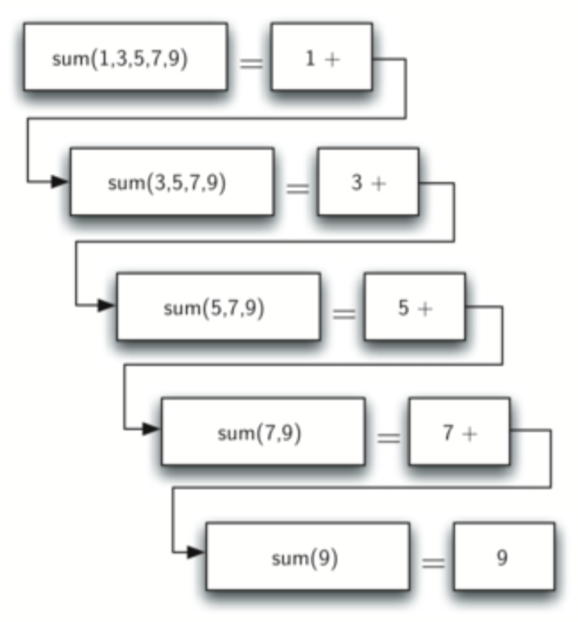
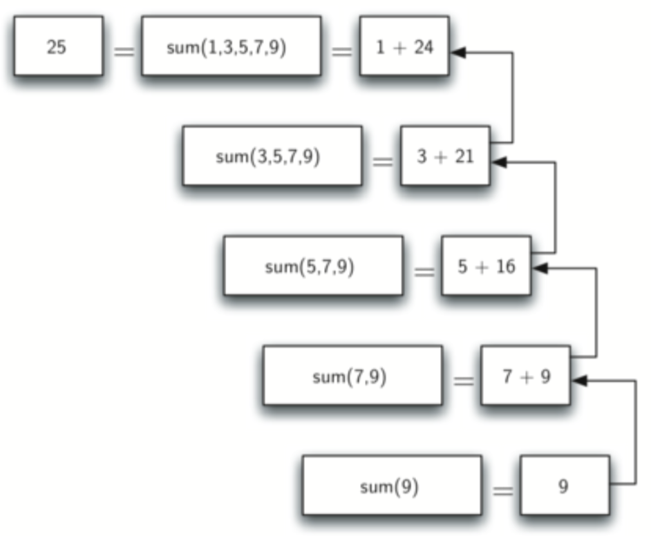
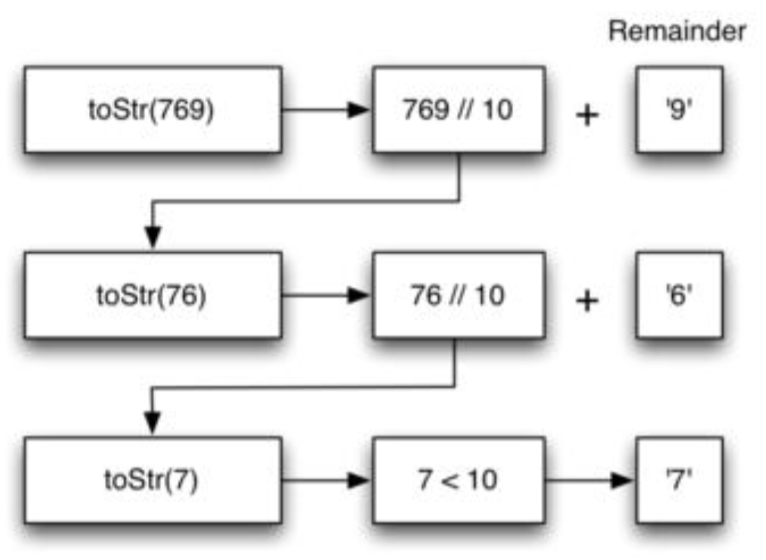
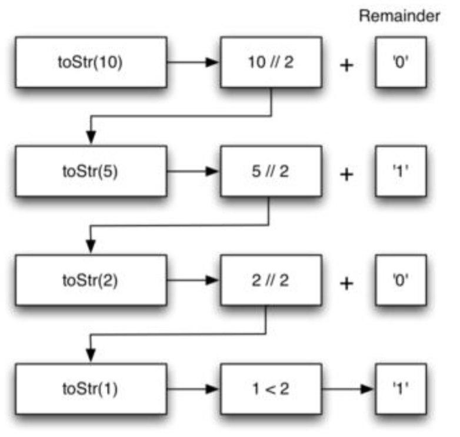
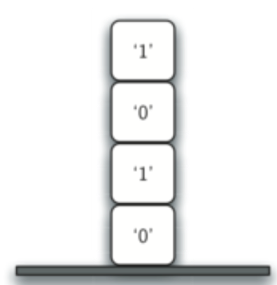
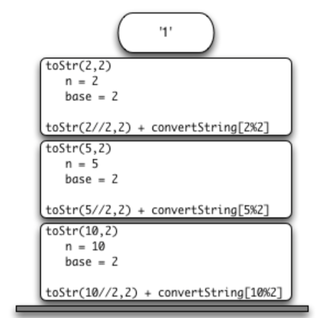

# RECURSION
 
## 4.1 Objectives
The goals for this chapter are as follows:  

- To understand that complex problems that may otherwise be difficult to solve may have a simple recursive solution.
- To learn how to formulate programs recursively.
- To understand and apply the three laws of recursion.
- To understand recursion as a form of iteration.
- To implement the recursive formulation of a problem.
- To understand how recursion is implemented by a computer system.

## 4.2 What is Recursion? 什么是递归
Recursion is a method of solving problems that involves breaking a problem down into smaller and smaller subproblems until you get to a small enough problem that it can be solved trivially. Usually recursion involves a function calling itself. While it may not seem like much on the surface, recursion allows us to write elegant solutions to problems that may otherwise be very difficult to program.  

### 4.2.1 Calculating the Sum of a List of Numbers
We will begin our investigation with a simple problem that you already know how to solve without using recursion. Suppose that you want to calculate the sum of a list of numbers such as: [1, 3, 5, 7, 9]. An iterative function that computes the sum is shown below. The function uses an accumulator variable (the_sum) to compute a running total of all the numbers in the list by starting with 0 and adding each number in the list.  

```python
def list_sum(num_list):
    the_sum = 0
    for i in num_list:
        the_sum = the_sum + i
    return the_sum

print(list_sum([1,3,5,7,9]))
```

Pretend for a minute that you do not have while loops or for loops. How would you compute the sum of a list of numbers? If you were a mathematician you might start by recalling that addition is a function that is defined for two parameters, a pair of numbers. To redefine the problem from adding a list to adding pairs of numbers, we could rewrite the list as a fully parenthesized expression. Such an expression looks like this:  

```
    ((((1+3)+5)+7)+9)
```

We can also parenthesize the expression the other way around,  

```
    (1+(3+(5+(7+9))))
```

Notice that the innermost set of parentheses, (7 + 9), is a problem that we can solve without a loop or any special constructs. In fact, we can use the following sequence of simplifications to compute a final sum.  

```
total = (1 + (3 + (5 + (7 + 9)))) 
total = (1 + (3 + (5 + 16))) 
total = (1 + (3 + 21)) 
total = (1 + 24)
total = 25
```

How can we take this idea and turn it into a Python program? Let's first state the sum problem in terms of Python lists. We might say the the sum of the list num_list is the sum of the first element of the list (num_list[0]), and the sum of the numbers in the rest of the list (num_list[1 :]). To state it in a functional form: list_sum(num_list) = first(num_list) + list_sum(rest(num_list)) In this equation first(num_list) returns the first element of the list and rest(num_list) returns a list of everything but the first element. This is easily expressed in Python as the following:  

我们如何将这个思想转换为一个Python程序？我们首先来声明一个python列表关系中的求和问题。我们

```python
def list_sum(num_list):
    if len(num_list) == 1:
        return num_list[0]
    else:
        return num_list[0] + list_sum(num_list[1:])

print(list_sum([1,3,5,7,9]))
```

There are a few key ideas in this to look at. First, on line 2 we are checking to see if the list is one element long. This check is crucial and is our escape clause from the function. The sum of a list of length 1 is trivial; it is just the number in the list. Second, on line 5 our function calls itself! This is the reason that we call the list_sum algorithm recursive. A recursive function is a function that calls itself.  

这里有几个要注意的关键理念，在第二行我们检查列表是否是为一个元素长度。


Figure 4.1: Series of Recursive Calls Adding a List of Numbers  

Figure 4.1 shows the series of recursive calls that are needed to sum the list [1, 3, 5, 7, 9]. You should think of this series of calls as a series of simplifications. Each time we make a recursive call we are solving a smaller problem, until we reach the point where the problem cannot get any smaller.  

图4。1展示了一系列对需要求和对列表[1, 3, 5, 7, 9]递归调用。你应该把系列调用当作是一系列的简化。每次我们执行一个递归调用我们就解决了一个小问题，直到我们抵达问题别被分割为更小问题的边界。  

When we reach the point where the problem is as simple as it can get, we begin to piece together the solutions of each of the small problems until the initial problem is solved. Figure 4.2 shows the additions that are performed as list_sum works its way backward through the series of calls. When list_sum returns from the topmost problem, we have the solution to the whole problem.  

当我们

### 4.2.2 The Three Laws of Recursion
Like the robots of Asimov, all recursive algorithms must obey three important laws:   

就像阿西莫夫的机器人一样，所有的递归算法都必须服从三个重要定律：  

1. A recursive algorithm must have a base case.
2. A recursive algorithm must change its state and move toward the base case. 
3. A recursive algorithm must call itself, recursively.

Let’s look at each one of these laws in more detail and see how it was used in the list_sum algorithm. First, a base case is the condition that allows the algorithm to stop recursing. A base case is typically a problem that is small enough to solve directly. In the list_sum algorithm the base case is a list of length 1.  

To obey the second law, we must arrange for a change of state that moves the algorithm toward the base case. A change of state means that some data that the algorithm is using is modified.  

要服从第二定律，我们必须


Figure 4.2: Series of Recursive Returns from Adding a List of Numbers  

Usually the data that represents our problem gets smaller in some way. In the list_sum algo- rithm our primary data structure is a list, so we must focus our state-changing efforts on the list. Since the base case is a list of length 1, a natural progression toward the base case is to shorten the list. This is exactly what happens on line 5 of the code below when we call list_sum with a shorter list.  

The final law is that the algorithm must call itself. This is the very definition of recursion. Recursion is a confusing concept to many beginning programmers. As a novice programmer, you have learned that functions are good because you can take a large problem and break it up into smaller problems. The smaller problems can be solved by writing a function to solve each problem. When we talk about recursion it may seem that we are talking ourselves in circles. We have a problem to solve with a function, but that function solves the problem by calling itself! But the logic is not circular at all; the logic of recursion is an elegant expression of solving a problem by breaking it down into a smaller and easier problems.  

In the remainder of this chapter we will look at more examples of recursion. In each case we will focus on designing a solution to a problem by using the three laws of recursion.  

## Self Check
How many recursive calls are made when computing the sum of the list [2, 4, 6, 8, 10]?  

1. 6
2. 5 
3. 4 
4. 3

Suppose you are going to write a recursive function to calculate the factorial of a number. fact(𝑛) returns 𝑛*𝑛−1*𝑛−2*... Where the factorial of zero is defined to be 1. What would be the most appropriate base case?  

1. 𝑛 == 0 
2. 𝑛 == 1 
3. 𝑛 >= 0 
4. 𝑛 <= 1


### 4.2.3 Converting an Integer to a String in Any Base
Suppose you want to convert an integer to a string in some base between binary and hexadec- imal. For example, convert the integer 10 to its string representation in decimal as “10,” or to its string representation in binary as “1010.” While there are many algorithms to solve this problem, including the algorithm discussed in the stack section, the recursive formulation of the problem is very elegant.  

Let’s look at a concrete example using base 10 and the number 769. Suppose we have a se- quence of characters corresponding to the first 10 digits, like conv_string = “0123456789”. It is easy to convert a number less than 10 to its string equivalent by looking it up in the sequence. For example, if the number is 9, then the string is conv_string[9] or “9.” If we can arrange to break up the number 769 into three single-digit numbers, 7, 6, and 9, then converting it to a string is simple. A number less than 10 sounds like a good base case.  

Knowing what our base is suggests that the overall algorithm will involve three components:  

1. Reduce the original number to a series of single-digit numbers.  
2. Convert the single digit-number to a string using a lookup.
3. Concatenate the single-digit strings together to form the final result.

The next step is to figure out how to change state and make progress toward the base case. Since we are working with an integer, let’s consider what mathematical operations might reduce a number. The most likely candidates are division and subtraction. While subtraction might work, it is unclear what we should subtract from what. Integer division with remainders gives us a clear direction. Let’s look at what happens if we divide a number by the base we are trying to convert to.  

Using integer division to divide 769 by 10, we get 76 with a remainder of 9. This gives us two good results. First, the remainder is a number less than our base that can be converted to a string immediately by lookup. Second, we get a number that is smaller than our original and moves us toward the base case of having a single number less than our base. Now our job is to convert 76 to its string representation. Again we will use integer division plus remainder to get results of 7 and 6 respectively. Finally, we have reduced the problem to converting 7, which we can do easily since it satisfies the base case condition of `𝑛 <base`, where base= 10. The series of operations we have just performed is illustrated in Figure 4.3. Notice that the numbers we want to remember are in the remainder boxes along the right side of the diagram.  

  
Figure4.3: ConvertinganIntegertoaStringinBase10   

The code below shows the Python code that implements the algorithm outlined above for any
base between 2 and 16.  

```python
 def to_str(n, base):
   convert_string = "0123456789ABCDEF"
   if n < base:
     return convert_string[n]
   else:
     return to_str(n / base, base) + convert_string[n % base]
 print(to_str(1453, 16))
```

Notice that in line 3 we check for the base case where 𝑛 is less than the base we are converting to. When we detect the base case, we stop recursing and simply return the string from the convertString sequence. In line 6 we satisfy both the second and third laws – by making the recursive call and by reducing the problem size – using division.  

Let us trace the algorithm again; this time we will convert the number 10 to its base 2 string representation (“1010”).
Figure 4.4 shows that we get the results we are looking for, but it looks like the digits are in the wrong order. The algorithm works correctly because we make the recursive call first on line 6, then we add the string representation of the remainder. If we reversed returning the convertString lookup and returning the toStr call, the resulting string would be backward! But by delaying the concatenation operation until after the recursive call has returned, we get the result in the proper order. This should remind you of our discussion of stacks back in the previous chapter.  

## Self Check
Write a function that takes a string as a parameter and returns a new string that is the reverse of the old string.  


Figure4.4: ConvertinganIntegertoaStringinBase10  

Write a function that takes a string as a parameter and returns True if the string is a palindrome, False otherwise. Remember that a string is a palindrome if it is spelled the same both forward and backward. for example: radar is a palindrome. for bonus points palindromes can also be phrases, but you need to remove the spaces and punctuation before checking. for example: madam i’m adam is a palindrome. Other fun palindromes include:  

• kayak
• aibohphobia
• Live not on evil
• Reviled did I live, said I, as evil I did deliver • Go hang a salami; I’m a lasagna hog.
• Able was I ere I saw Elba
• Kanakanak – a town in Alaska
• Wassamassaw – a town in South Dakota


## 4.3 Stack Frames: Implementing Recursion
Suppose that instead of concatenating the result of the recursive call to toStr with the string from convertString, we modified our algorithm to push the strings onto a stack prior to making the recursive call. The code for this modified algorithm is shown in the code below.  

```python
import Stack  # As previously defined


r_stack = Stack()
def to_str(n, base):
   convert_string = "0123456789ABCDEF"
   while n > 0:
      if n < base:
         r_stack.push(convert_string[n])
      else:
         r_stack.push(convert_string[n % base])
      n = n // base
   res = ""
   while not r_stack.is_empty():
      res = res + str(r_stack.pop())
   return res
print(to_str(1453, 16))
```

Each time we make a call to toStr, we push a character on the stack. Returning to the previous example we can see that after the fourth call to toStr the stack would look like Figure 4.5. Notice that now we can simply pop the characters off the stack and concatenate them into the final result, “1010.”  


Figure 4.5: Strings Placed on the Stack During Conversion

The previous example gives us some insight into how Python implements a recursive function call. When a function is called in Python, a **stack frame** is allocated to handle the local vari- ables of the function. When the function returns, the return value is left on top of the stack for the calling function to access. Figure 4.6 illustrates the call stack after the return statement on line 4.  

Notice that the call to toStr(2//2, 2) leaves a return value of “” on the stack. This return value is then used in place of the function call (toStr(1, 2)) in the expression “1” + convertString[2%2], which will leave the string “10” on the top of the stack. In this way, the Python call stack takes the place of the stack we used explicitly earlier. In our list summing example, you can think of the return value on the stack taking the place of an accumulator variable.  

The stack frames also provide a scope for the variables used by the function. Even though we are calling the same function over and over, each call creates a new scope for the variables that are local to the function.  


Figure 4.6: Call Stack Generated from toStr(10,2)

If you keep this idea of the stack in your head, you will find it much easier to write a proper
recursive function.  

## 4.4 Visualising Recursion
In the previous section we looked at some problems that were easy to solve using recursion; however, it can still be difficult to find a mental model or a way of visualizing what is happening in a recursive function. This can make recursion difficult for people to grasp. In this section we will look at a couple of examples of using recursion to draw some interesting pictures. As you watch these pictures take shape you will get some new insight into the recursive process that may be helpful in cementing your understanding of recursion.  

The tool we will use for our illustrations is Python’s turtle graphics module called turtle. The turtle module is standard with all versions of Python and is very easy to use. The metaphor is quite simple. You can create a turtle and the turtle can move forward, backward, turn left, turn right, etc. The turtle can have its tail up or down. When the turtle’s tail is down and the turtle moves it draws a line as it moves. To increase the artistic value of the turtle you can change the width of the tail as well as the color of the ink the tail is dipped in.  

Here is a simple example to illustrate some turtle graphics basics. We will use the turtle module to draw a spiral recursively.The code below shows how it is done. After importing the turtle module we create a turtle. When the turtle is created it also creates a window for itself to draw in. Next we define the drawSpiral function. The base case for this simple function is when the length of the line we want to draw, as given by the len parameter, is reduced to zero or less. If the length of the line is longer than zero we instruct the turtle to go forward by len units and then turn right 90 degrees. The recursive step is when we call drawSpiral again with a reduced length. At the end of the code below you will notice that we call the function my_win.exitonclick(), this is a handy little method of the window that puts the turtle into a wait mode until you click inside the window, after which the program cleans up and exits.  

```python
import turtle

my_turtle = turtle.Turtle()
my_win = turtle.Screen()


def draw_spiral(my_turtle, line_len):
   if lineLen > 0:
      my_turtle.forward(line_len)
      my_turtle.right(90)
      draw_spiral(my_turtle, line_len - 5)

draw_spiral(my_turtle, 100)
my_win.exitonclick()
```

That is really about all the turtle graphics you need to know in order to make some pretty impressive drawings. For our next program we are going to draw a fractal tree. Fractals come from a branch of mathematics, and have much in common with recursion. The definition of a fractal is that when you look at it the fractal has the same basic shape no matter how much you magnify it. Some examples from nature are the coastlines of continents, snowflakes, mountains, and even trees or shrubs. The fractal nature of many of these natural phenomenon makes it possible for programmers to generate very realistic looking scenery for computer generated movies. In our next example we will generate a fractal tree.  

To understand how this is going to work it is helpful to think of how we might describe a tree using a fractal vocabulary. Remember that we said above that a fractal is something that looks the same at all different levels of magnification. If we translate this to trees and shrubs we might say that even a small twig has the same shape and characteristics as a whole tree. Using this idea we could say that a tree is a trunk, with a smaller tree going off to the right and another smaller tree going off to the left. If you think of this definition recursively it means that we will apply the recursive definition of a tree to both of the smaller left and right trees.  

Lets translate this idea to some Python code. The code below shows how we can use our turtle to generate a fractal tree. Lets look at the code a bit more closely. You will see that on lines 5 and 7 we are making a recursive call. On line 5 we make the recursive call right after the turtle turns to the right by 20 degrees; this is the right tree mentioned above. Then in line 7 the turtle makes another recursive call, but this time after turning left by 40 degrees. The reason the turtle must turn left by 40 degrees is that it needs to undo the original 20 degree turn to the right and then do an additional 20 degree turn to the left in order to draw the left tree. Also notice that each time we make a recursive call to tree we subtract some amount from the branchLen parameter; this is to make sure that the recursive trees get smaller and smaller. You should also recognize the initial if statement on line 2 as a check for the base case of branchLen getting too small.  


